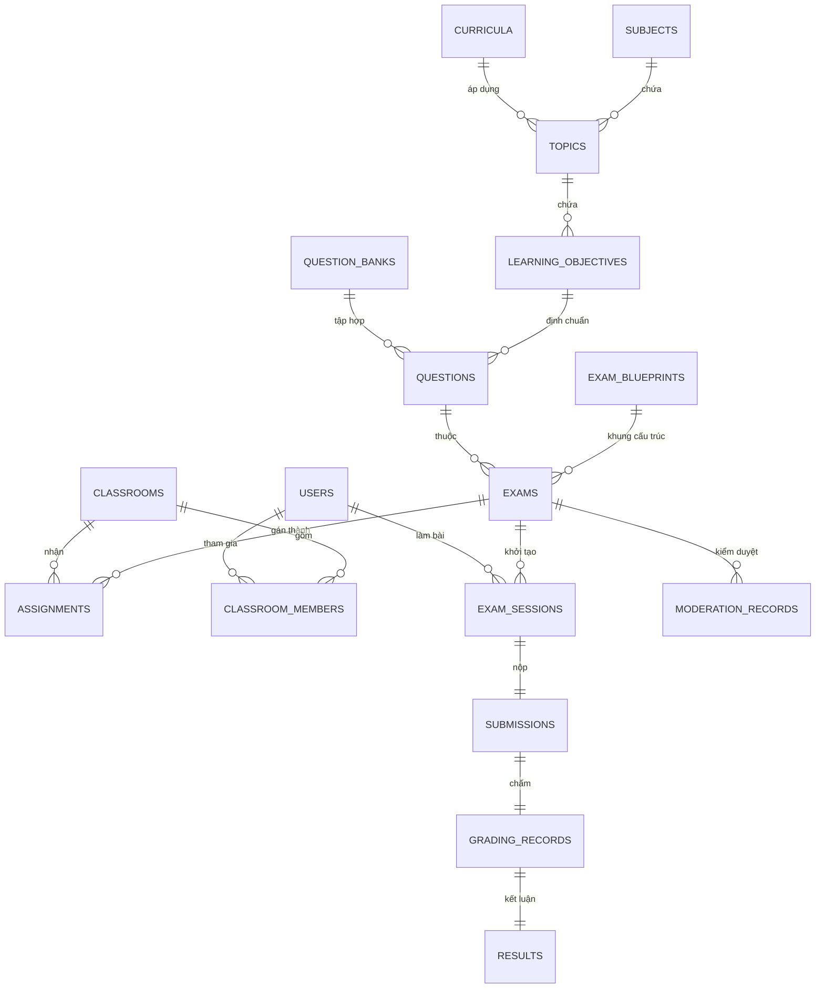
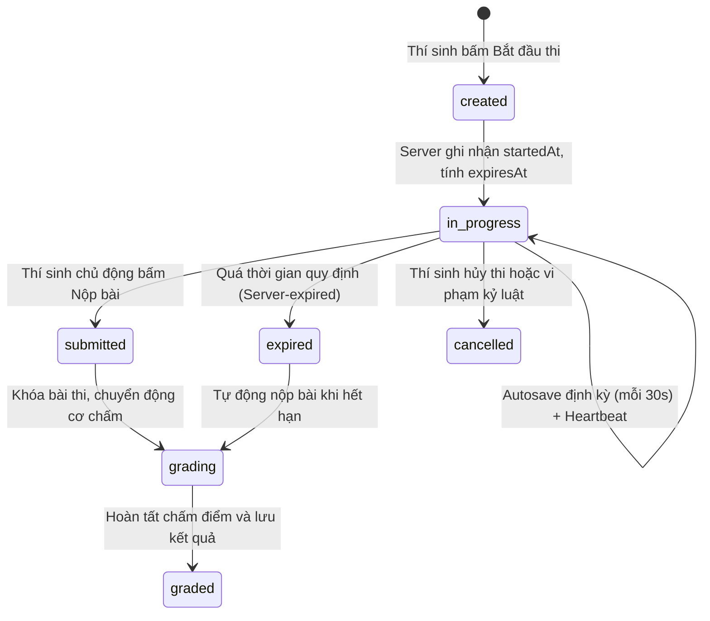
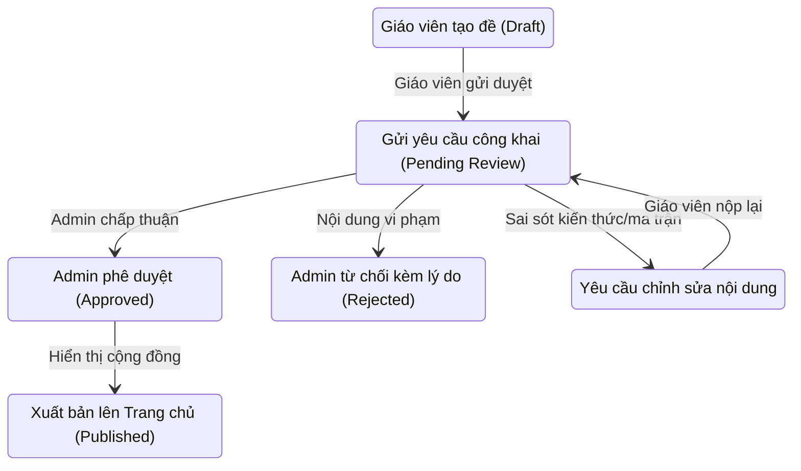

# KIẾN TRÚC TỔNG THỂ EDUSPACE V3 (ARCHITECTURAL SPECIFICATION)
## Next-Generation Database-First Educational Platform

> **Dự án:** EduSpace by ND Labs  
> **Phiên bản kiến trúc:** V3.0-Design (Giai đoạn 1: Khảo sát, Kiểm toán & Thiết kế Kiến trúc)  
> **Trạng thái:** CANONICAL ARCHITECTURAL SPECIFICATION  
> **Môi trường mục tiêu:** React + TypeScript + Vite + Tailwind CSS + Firebase Backend (Firestore & Cloud Functions)  
> **Ngày hoàn thiện thiết kế:** 16/09/2026  
> **Tài liệu tham chiếu:** [eduspace-v3-database-schema.md](eduspace-v3-database-schema.md), [eduspace-v3-api-contract.md](eduspace-v3-api-contract.md), [DATABASE.md](DATABASE.md), [ARCHITECTURE_DECISIONS.md](ARCHITECTURE_DECISIONS.md), [SECURITY.md](SECURITY.md), [AUTH_RULES.md](AUTH_RULES.md), [PROJECT_RULES.md](PROJECT_RULES.md)

---

## MỤC LỤC

1. [TỔNG QUAN & BỐI CẢNH DỰ ÁN](#1-tổng-quan--bối-cảnh-dự-án)
2. [KIỂM TOÁN CHI TIẾT HỆ THỐNG V2 (V2 SYSTEM AUDIT)](#2-kiểm-toán-chi-tiết-hệ-thống-v2-v2-system-audit)
   - 2.1. Hiện trạng kiến trúc & Các luồng chức năng đang chạy
   - 2.2. Kiểm kê dữ liệu động đang bị lưu cứng trong file tĩnh (Static Content Inventory)
   - 2.3. Cấu trúc Database Firestore hiện hữu của V2
   - 2.4. Hạn chế, rủi ro và nợ kỹ thuật của V2
   - 2.5. Tài nguyên và tính năng cốt lõi bắt buộc bảo toàn 100%
3. [MỤC TIÊU VÀ NGUYÊN TẮC THIẾT KẾ V3](#3-mục-tiêu-và-nguyên-tắc-thiết-kế-v3)
4. [KIẾN TRÚC DỮ LIỆU ĐỘNG: DATABASE-FIRST ARCHITECTURE](#4-kiến-trúc-dữ-liệu-động-database-first-architecture)
   - 4.1. Nguyên tắc ranh giới tuyệt đối: Source Code vs Dynamic Content
   - 4.2. Danh mục miền dữ liệu V3 (Domain Inventory)
   - 4.3. Đặc tả mô hình dữ liệu Canonical V3 (TypeScript Definitions & Database Schemas)
5. [HỆ THỐNG PHIÊN BẢN HÓA DỮ LIỆU (VERSIONED DATA SCHEMA)](#5-hệ-thống-phiên-bản-hóa-dữ-liệu-versioned-data-schema)
6. [TẦNG CHUẨN HÓA VÀ ĐỌC DỮ LIỆU TƯƠNG THÍCH NGƯỢC (NORMALIZATION LAYER)](#6-tầng-chuẩn-hóa-và-đọc-dữ-liệu-tương-thích-ngược-normalization-layer)
   - 6.1. Kiến trúc luồng đọc (Read Pipeline)
   - 6.2. Bộ chuyển đổi và chuẩn hóa dữ liệu mẫu
   - 6.3. Khả năng thích ứng với biến đổi cấu trúc tương lai
7. [KIẾN TRÚC GHI DỮ LIỆU AN TOÀN (WRITE COMPATIBILITY & MUTATION LAYER)](#7-kiến-trúc-ghi-dữ-liệu-an-toàn-write-compatibility--mutation-layer)
8. [CHIẾN LƯỢC ĐA BẢN SAO LƯU & PHỤC HỒI (MULTIPLE BACKUPS & RESTORE STRATEGY)](#8-chiến-lược-đa-bản-sao-lưu--phục-hồi-multiple-backups--restore-strategy)
   - 8.1. Định dạng bản sao lưu nhiều thế hệ (Generational Backups)
   - 8.2. Lưu trữ bản sao lưu Off-Site
   - 8.3. Quy trình 7 bước sao lưu bắt buộc trước di chuyển dữ liệu (Pre-Migration Backup Protocol)
   - 8.4. Chiến lược khôi phục và kiểm thử tính toàn vẹn
9. [ĐỘNG CƠ KHẢO THÍ ĐA NĂNG (UNIVERSAL ASSESSMENT ENGINE)](#9-động-cơ-khảo-thí-đa-năng-universal-assessment-engine)
   - 9.1. Chu trình khảo thí toàn diện
   - 9.2. Chuẩn siêu dữ liệu GDPT 2018 (Chương trình Giáo dục phổ thông 2018)
   - 9.3. Đặc tả 20+ dạng câu hỏi (Question Types)
   - 9.4. Động cơ Ma trận đề thi / Đặc tả đề (Exam Blueprint Engine)
10. [PHIÊN THI VÀ ĐỘNG CƠ THỰC THI BẢO MẬT (EXAM SESSION ENGINE)](#10-phiên-thi-và-động-cơ-thực-thi-bảo-mật-exam-session-engine)
11. [HỆ THỐNG CHẤM ĐIỂM BẢO MẬT & TRỢ LÝ AI (SECURE & AI GRADING)](#11-hệ-thống-chấm-điểm-bảo-mật--trợ-lý-ai-secure--ai-grading)
12. [KHÔNG GIAN LÀM VIỆC CỦA GIÁO VIÊN (TEACHER WORKSPACE)](#12-không-gian-làm-việc-của-giáo-viên-teacher-workspace)
13. [HỆ THỐNG PHÂN QUYỀN VÀ DUYỆT BÀI CỘNG ĐỒNG (PUBLIC MODERATION WORKFLOW)](#13-hệ-thống-phân-quyền-và-duyệt-bài-cộng-đồng-public-moderation-workflow)
14. [KHÔNG GIAN HỌC TẬP CỦA HỌC SINH (STUDENT WORKSPACE)](#14-không-gian-học-tập-của-học-sinh-student-workspace)
15. [HỆ THỐNG QUẢN TRỊ NỀN TẢNG (ADMIN MANAGEMENT SYSTEM)](#15-hệ-thống-quản-trị-nền-tảng-admin-management-system)
16. [THIẾT KẾ ĐỘC LẬP MỞ RỘNG (CONFIGURATION-FIRST & DYNAMIC REGISTRIES)](#16-thiết-kế-độc-lập-mở-rộng-configuration-first--dynamic-registries)
17. [ĐỊNH HƯỚNG TÍCH HỢP HỆ THỐNG CHẤM BÀI TRỰC TUYẾN TƯƠNG LAI (FUTURE ONLINE JUDGE - OJ)](#17-định-hướng-tích-hợp-hệ-thống-chấm-bài-trực-tuyến-tương-lai-future-online-judge---oj)
18. [KIẾN TRÚC FRONTEND REACT & TYPESCRIPT MODULAR](#18-kiến-trúc-frontend-react--typescript-modular)
19. [GIAO KÈO BẢO MẬT VÀ QUY TẮC BẤT BIẾN (SECURITY CONTRACTS & INVARIANTS)](#19-giao-kèo-bảo-mật-và-quy-tắc-bất-biến-security-contracts--invariants)
20. [CHIẾN LƯỢC CACHE VÀ HIỆU NĂNG](#20-chiến-lược-cache-và-hiệu-năng)
21. [KẾ HOẠCH KIỂM THỬ TOÀN DIỆN (TESTING STRATEGY)](#21-kế-hoạch-kiểm-thử-toàn-diện-testing-strategy)
22. [KẾ HOẠCH CHUYỂN ĐỔI KHÔNG PHÁ HỦY V2 → V3 (MIGRATION PLAN)](#22-kế-hoạch-chuyển-đổi-không-phá-hủy-v2--v3-migration-plan)

---

## 1. TỔNG QUAN & BỐI CẢNH DỰ ÁN

EduSpace by ND Labs là nền tảng khảo thí và học tập trực tuyến trọng tâm của hệ sinh thái ND Labs. Hệ thống đã trải qua các giai đoạn phát triển:
- **V1 (Legacy/Original System):** Phiên bản sơ khai tạo dựng nền tảng bài thi trắc nghiệm tĩnh bằng Vanilla HTML/JS.
- **V2 (Current System):** Hệ thống đang vận hành, sở hữu giao diện được nâng cấp (Glassmorphism, Tailwind CSS, Lucide icons, KaTeX), hỗ trợ chế độ Luyện tập và Thi thử, trình tạo đề nâng cao (`/taode/`), phân quyền kiểm tra Firestore cho giáo viên (`/teacher/`), quản trị trung tâm (`/admin/eduspace/`), đồng thời tương thích với tài khoản định danh Canonical ND Labs.
- **V3 (Next-Generation Platform):** Nền tảng thế hệ mới được tái thiết kế hoàn toàn trên kiến trúc **Database-First**, xây dựng bằng **React + TypeScript + Vite + Tailwind CSS**, phân tách mô đun rõ ràng giữa UI, Domain Models, Data Access, Normalization, Exam Engine, Grading Engine và Admin/Teacher Workspaces.

### Mục tiêu cốt lõi của V3:
1. **Tuyệt đối loại bỏ việc lưu trữ nội dung động trong source code.** Toàn bộ môn học, bài thi, câu hỏi, lớp học, bài tập, phân quyền và cấu hình phải xuất phát từ Database/API.
2. **Không phá vỡ dữ liệu V2 hiện hữu.** Toàn bộ đề thi, kết quả làm bài của học sinh và lớp học trong V2 phải tiếp tục khả dụng thông qua Tầng tương thích ngược (Backward-Compatible Normalizer).
3. **Bảo vệ tuyệt đối các thành phần bất biến:** Hệ thống Thời khóa biểu (TimeTable), Tài khoản Owner `CodeID = "0000"`, Quy chuẩn định danh NDID và cơ chế phân quyền máy chủ (Server-authoritative Authorization).

---

## 2. KIỂM TOÁN CHI TIẾT HỆ THỐNG V2 (V2 SYSTEM AUDIT)

### 2.1. Hiện trạng kiến trúc & Các luồng chức năng đang chạy

Khảo sát toàn diện mã nguồn V2 tại thư mục `eduspace/`, `admin/eduspace/`, `assets/js/` và `functions/` cho thấy:

```
                  ┌────────────────────────────────────────────────────────┐
                  │                 HỆ THỐNG EDUSPACE V2                   │
                  └───────────────────────────┬────────────────────────────┘
                                              │
         ┌────────────────────────────────────┼────────────────────────────────────┐
         ▼                                    ▼                                    ▼
┌──────────────────┐               ┌───────────────────────┐             ┌──────────────────┐
│  PORTAL & VIEWER │               │   TEACHER & BUILDER   │             │  ADMIN & BACKEND │
├──────────────────┤               ├───────────────────────┤             ├──────────────────┤
│ eduspace/        │               │ eduspace/teacher/     │             │ admin/eduspace/  │
│  - index.html    │               │  - Lớp học (JoinCode) │             │  - Tạo bài bằng  │
│  - beta.html     │               │  - Gán bài & Bảng điểm│             │    Word / AI     │
│  - template.html │               │ eduspace/taode/       │             │  - Đồng bộ thủ   │
│  - exam/?id=...  │               │  - Mammoth parser     │             │    công Firebase │
│  - Các môn học   │               │  - Xuất data.js/Cloud │             │ Cloud Functions  │
└──────────────────┘               └───────────────────────┘             └──────────────────┘
```

1. **Trang cổng (Portal - `eduspace/index.html` & `beta.html`):**
   - Quản lý danh mục bài giảng, đề thi.
   - Sử dụng biến toàn cục `window.quizList`.
   - Kết nối Firestore lấy bài học động từ collection `eduspace_lessons` qua hàm `window.loadDynamicLessons()`.
   - Cung cấp tính năng tra cứu nhanh mã đề thi, mở modal xem trước metadata.
   - Có cơ chế Onboarding hồ sơ đầu năm học (cập nhật lớp, trường, vai trò giáo viên/học sinh vào `users/{CodeID}`).
2. **Trình làm bài thi (Exam Runner - `eduspace/template.html` & `eduspace/exam/index.html`):**
   - Hỗ trợ 2 chế độ: Luyện tập (Practice) và Thi thử (Exam).
   - Hỗ trợ 4 định dạng câu hỏi V2: Trắc nghiệm 4 lựa chọn (`multiple`), Đúng/Sai 4 ý (`truefalse`), Trả lời ngắn điền số/chữ (`short`), Tự luận (`essay`).
   - Xử lý công thức Toán học bằng KaTeX Auto-render, Markdown bằng Marked.js.
   - Tích hợp EduAI Assistant (kết nối Gemini API qua Cloud Function proxy `/api/geminiProxy`).
   - Kiểm tra quyền truy cập đề thi: `public`, `classroom` (đối chiếu `studentUids` trong `classrooms`), `private` (chỉ `creatorUid`).
3. **Khu vực Giáo viên (Teacher Portal - `eduspace/teacher/index.html`):**
   - Quản lý lớp học bằng mã số 6 chữ số ngẫu nhiên.
   - Danh sách đề thi do giáo viên khởi tạo kèm trạng thái chia sẻ (`public`, `private`, `classroom`).
   - Bảng điểm (Gradebook) đọc trực tiếp từ collection `attempts`.
4. **Khu vực Soạn thảo đề thi (`eduspace/taode/index.html`):**
   - Phân tích văn bản tự động từ file Microsoft Word (`.docx`) bằng Mammoth.js và biểu thức chính quy (Regex).
   - Tự động nhận diện cấu trúc đề 3 phần theo định dạng đề minh họa Bộ Giáo dục & Đào tạo.
   - Xuất dữ liệu ra file `data.js` hoặc đẩy trực tiếp lên collection `quizzes` trên Firestore.
5. **Khu vực Quản trị (`admin/eduspace/index.html`):**
   - Giao diện Admin quản trị tập trung tất cả bài giảng và đề thi.
   - Công cụ đồng bộ hàng loạt (Bulk Sync): Đọc toàn bộ danh sách `quizList` tĩnh, fetch các file `data.js` cục bộ, phân tích mã lệnh JavaScript bằng `new Function()` rồi ghi vào Firestore (`eduspace_lessons` và `quizzes`).

### 2.2. Kiểm kê dữ liệu động đang bị lưu cứng trong file tĩnh (Static Content Inventory)

V2 hiện tồn tại tình trạng lưu trữ dữ liệu động phân tán trong mã nguồn tĩnh:
1. **Các thư mục môn học tĩnh:**
   - Hơn 150 thư mục con nằm rải rác trong `eduspace/toan/`, `eduspace/vatly/`, `eduspace/hoahoc/`, `eduspace/sinhhoc/`, `eduspace/tinhoc/`, `eduspace/nguvan/`, `eduspace/lichsu/`, `eduspace/diali/`, `eduspace/ktpl/`, `eduspace/gdqp/`, `eduspace/congnghe/`, `eduspace/tienganh/`, `eduspace/thptqg/`.
   - Mỗi thư mục chứa một file `data.js` chứa cấu trúc `window.quizData = { title, config, questions, examInfo }` và một file `index.html` chỉ có tác dụng nạp `data.js` rồi nhúng `template.html`.
2. **Metadata môn học & câu châm ngôn:**
   - Được định nghĩa cứng trong các đối tượng JavaScript: `subjectQuotes`, `getSubjectColor()` nằm trực tiếp trong `eduspace/index.html`.
3. **Danh mục khối lớp và phân loại:**
   - Danh sách khối lớp (1 đến 12), danh sách môn giảng dạy được hardcode trong mảng `ONBOARD_SUBJECTS` tại `index.html`.
4. **Cấu hình ma trận thang điểm:**
   - Được fix cứng trong từng file `data.js`: ví dụ `pointsPerQ: 0.25`, `partialScoring: [0.1, 0.25, 0.5, 1]`.

### 2.3. Cấu trúc Database Firestore hiện hữu của V2

Qua kiểm toán `firestore.rules` và các mã nguồn thao tác Firestore, V2 hiện tương tác với các collection sau:

| Collection / Path | Mô tả cấu trúc dữ liệu V2 | Hạn chế hiện tại |
|---|---|---|
| `users/{CodeID}` | Lưu hồ sơ người dùng: `codeId`, `ndid`, `role`, `adminLevel`, `school`, `grade`, `eduRole`, `teachingGrades`, `subjects`. | Thiếu phân quyền chuyên sâu cho bài tập và môn học cụ thể. |
| `quizzes/{quizId}` | Lưu đề thi do giáo viên hoặc admin tạo: `creatorUid`, `title`, `subject`, `grade`, `duration`, `visibility`, `targetClassrooms`, `quizData`. | `quizData` là một cục JSON nguyên khối lưu toàn bộ câu hỏi bên trong; không có `schemaVersion`; không có ngân hàng câu hỏi tách rời; không có ma trận đặc tả chuẩn GDPT 2018. |
| `eduspace_lessons/{id}` | Lưu bài học hoặc thẻ hiển thị trang chủ: `title`, `type`, `description`, `url`, `tag`, `class`, `subject`, `isHot`, `isComingSoon`, `createdAt`. | Lưu trữ dạng phẳng, lẫn lộn giữa đề kiểm tra (`quiz`) và tài liệu lý thuyết (`lesson`). |
| `classrooms/{classroomId}` | Lưu lớp học: `className`, `creatorUid`, `studentUids` (mảng string), `studentNdids`, `createdAt`. | Dùng mảng phẳng `studentUids` dễ chạm trần kích thước tài liệu Firestore 1MB khi lớp đông học sinh; không có trạng thái bài tập (assignments) độc lập. |
| `attempts/{attemptId}` | Lưu kết quả làm bài: `quizId`, `quizTitle`, `studentUid`, `studentName`, `studentNdid`, `correctAnswers`, `totalQuestions`, `score`, `submittedAt`. | Điểm số và số câu đúng do client tự tính toán rồi gửi lên Firestore; rủi ro gian lận điểm số cực kỳ cao; không lưu phiên thi có kiểm soát thời gian máy chủ. |

### 2.4. Hạn chế, rủi ro và nợ kỹ thuật của V2

1. **Khách hàng tự quyết định điểm số (Client-calculated scoring):** File `template.html` tính điểm trên JavaScript trình duyệt và trực tiếp ghi điểm vào Firestore `attempts`.
2. **Không có phiên thi được xác thực máy chủ (Server-authoritative Exam Session):** Đồng hồ đếm ngược chạy bằng `setInterval` trên trình duyệt; học sinh có thể tạm dừng JavaScript hoặc chỉnh sửa DOM để gian lận thời gian.
3. **Dữ liệu đề thi dạng khối tĩnh (Monolithic Document):** Lưu toàn bộ 40-50 câu hỏi vào một trường `quizData` khiến không thể tái sử dụng câu hỏi cho các đề khác, không phân loại được theo chuẩn kiến thức kỹ năng GDPT 2018.
4. **Không có quy trình kiểm duyệt nội dung cộng đồng:** Đề thi công khai (`visibility: 'public'`) do giáo viên tạo có thể hiển thị trực tiếp mà không qua phê duyệt của Quản trị viên (Admin).
5. **Khối mã nguồn HTML/JS khổng lồ (2.700 dòng trong Admin, 1.850 dòng trong Template):** Mã nguồn lồng ghép giữa DOM manipulation, logic nghiệp vụ, kết nối mạng và CSS inline gây khó khăn nghiêm trọng cho bảo trì và mở rộng.

### 2.5. Tài nguyên và tính năng cốt lõi bắt buộc bảo toàn 100%

Tuân thủ nghiêm ngặt các quy tắc dự án:
1. **Thời khóa biểu (TimeTable):** Tuyệt đối KHÔNG sửa đổi cấu trúc, dữ liệu hoặc mã nguồn của `timetables/{timetableId}`, `eduspace/timetable` và `src/timetable`. EduSpace V3 chỉ duy trì liên kết điều hướng tới phân hệ này.
2. **Tài khoản Owner CodeID `0000`:** Tuyệt đối không thay đổi thông tin định danh, quyền hạn hoặc trạng thái tài khoản `0000`.
3. **Bảo toàn dữ liệu Quiz đã lưu:** Toàn bộ bản ghi trong `quizzes`, `eduspace_lessons` và `attempts` phải được giữ nguyên vẹn, không được xóa bỏ.
4. **Bảo toàn chuỗi gốc NDID:** Không áp dụng regex lọc bỏ ký tự đặc biệt đối với dữ liệu từ DB, không tự ý chèn tiền tố `@` vào giao diện.
5. **Cơ chế xác thực Canonical Auth:** Firebase Auth UID bắt buộc phải bằng CodeID.

---

## 3. MỤC TIÊU VÀ NGUYÊN TẮC THIẾT KẾ V3

1. **Database-First 100%:** Toàn bộ nội dung học tập và cấu hình hệ thống phải được tải từ cơ sở dữ liệu Firestore/API. Source code chỉ chứa ứng dụng (Components, Hooks, Types, Adapters, Engine).
2. **Phân tách tầng rõ rệt (Clean Layered Architecture):**
   - **UI Layer:** Các component React thuần chức năng hiển thị, tiếp nhận sự kiện từ người dùng.
   - **Domain Layer:** Chứa các thực thể Canonical Models chuẩn hóa, độc lập với nguồn lưu trữ.
   - **Data Access & Normalization Layer:** Bộ điều hợp kết nối Firestore/REST API, phát hiện schema version và chuẩn hóa dữ liệu cũ/mới thành Canonical Domain Models.
   - **Business & Security Layer:** Kiểm tra quyền hạn, xác thực phiên thi, quản lý luồng trạng thái, chống gian lận.
   - **Engine Layer:** Động cơ khảo thí, phân tích ma trận đề, động cơ chấm điểm độc lập.
3. **Mở rộng không cần sửa code giao diện (Extensibility via Registries):** Thêm dạng câu hỏi mới, môn học mới, chương trình sách giáo khoa mới chỉ cần đăng ký qua Registry hoặc cập nhật cấu hình trong Database.
4. **An toàn dữ liệu & Sao lưu đa thế hệ:** Bất kỳ thay đổi cấu trúc nào cũng phải có quy trình xác thực, kiểm thử, sao lưu trước khi thực thi và khả năng phục hồi dữ liệu tức thời.

---

## 4. KIẾN TRÚC DỮ LIỆU ĐỘNG: DATABASE-FIRST ARCHITECTURE

### 4.1. Nguyên tắc ranh giới tuyệt đối: Source Code vs Dynamic Content

| Danh mục | Nơi lưu trữ được phép | Quy định nghiêm ngặt |
|---|---|---|
| **Source Code (Mã nguồn ứng dụng)** | Thư mục `src/eduspace/` của Git repository | Chỉ chứa mã TypeScript, React JSX, CSS Tailwind, Schema Types, Adapters, Migration Scripts, Validation rules. Tuyệt đối không chứa file `data.js`, câu hỏi thi, đề thi mẫu, danh sách lớp học thực tế. |
| **Dynamic Content (Dữ liệu người dùng & Khảo thí)** | Cơ sở dữ liệu Cloud Firestore | Môn học, bộ sách, khối lớp, ngân hàng câu hỏi, ma trận đề, đề thi, bài tập lớp học, danh sách thành viên, bài nộp, điểm số, kết quả, log kiểm duyệt. |
| **Operational Config (Cấu hình vận hành)** | Firestore `system_settings` & Realtime DB `/config/` | Cấu hình bảo mật hệ thống, API Key proxy Gemini, cờ bật tắt tính năng (feature flags), danh sách dạng câu hỏi khả dụng. |

### 4.2. Danh mục miền dữ liệu V3 (Domain Inventory)

Hệ thống EduSpace V3 xây dựng kiến trúc tối giản, phân ranh giới mạch lạc nhưng đầy đủ cho toàn bộ nền tảng giáo dục:



### 4.3. Đặc tả mô hình dữ liệu Canonical V3 (TypeScript Definitions & Database Schemas)

Tất cả tài liệu lưu trữ cốt lõi trong Firestore đều có trường bắt buộc: `schemaVersion: number`.

#### 1. Miền Học thuật & Chương trình (Curriculum & Taxonomy)
- Collection `subjects`: Danh mục các môn học (Toán, Ngữ văn, Tiếng Anh, Vật lí, Hóa học, Sinh học, Tin học, Lịch sử, Địa lí, GD KT&PL, Công nghệ...).
- Collection `curricula`: Các bộ sách giáo khoa / khung chương trình GDPT 2018 (Kết nối tri thức, Cánh diều, Chân trời sáng tạo, Chương trình chuyên ban...).
- Collection `topics`: Chủ đề, chuyên đề, bài học theo khối lớp và môn học.
- Collection `learning_objectives`: Chuẩn kiến thức kỹ năng / Yêu cầu cần đạt (YCCĐ).

```typescript
export interface CanonicalSubject {
  schemaVersion: 1;
  id: string;                  // e.g. "toan", "vatly", "tinhoc"
  name: string;                // e.g. "Toán học"
  code: string;                // e.g. "MATH"
  icon: string;                // Lucide icon name
  color: string;               // Mã màu Hex đại diện môn
  applicableGrades: number[];  // [6, 7, 8, 9, 10, 11, 12]
  status: 'active' | 'archived';
  orderIndex: number;
}

export interface CanonicalCurriculum {
  schemaVersion: 1;
  id: string;                  // e.g. "kntt", "canhdieu", "ctst"
  name: string;                // e.g. "Kết nối tri thức với cuộc sống"
  shortName: string;           // "KNTT"
  publisher: string;
  yearIntroduced: number;      // 2018
}

export interface CanonicalLearningObjective {
  schemaVersion: 1;
  id: string;                  // Mã YCCĐ chuẩn, e.g. "YCCD-TOAN-10-HHK-01"
  subjectId: string;
  grade: number;
  topicId: string;
  code: string;
  statement: string;           // Nội dung yêu cầu cần đạt theo TT 22 / Bộ GD&ĐT
  cognitiveLevel: 'recognition' | 'comprehension' | 'application' | 'high_application';
  competencies: string[];      // ['tu_duy_toan_hoc', 'giai_quyet_van_de']
}
```

#### 2. Miền Ngân hàng Câu hỏi & Đề thi (Assessment & Question Bank)
- Collection `questions`: Đơn vị câu hỏi độc lập với đầy đủ siêu dữ liệu khảo thí GDPT 2018.
- Collection `question_banks`: Ngân hàng gom nhóm câu hỏi theo giáo viên, trường học hoặc tổ bộ môn.
- Collection `exam_blueprints`: Ma trận đề thi đặc tả tỉ lệ câu hỏi, số điểm và mức độ nhận thức.
- Collection `exams`: Đề thi hoàn chỉnh (tập hợp các câu hỏi hoặc cấu hình rút ngẫu nhiên từ ma trận).

```typescript
export type CognitiveLevel = 'recognition' | 'comprehension' | 'application' | 'high_application';
export type QuestionType =
  | 'single_choice'
  | 'multiple_choice'
  | 'true_false'
  | 'short_answer'
  | 'numeric'
  | 'fill_blank'
  | 'matching'
  | 'ordering'
  | 'essay'
  | 'reading_comprehension'
  | 'listening'
  | 'speaking'
  | 'grouped'
  | 'code_programming';

export interface CanonicalQuestion {
  schemaVersion: 1;
  id: string;
  questionBankId?: string;
  authorCodeId: string;        // Khóa tham chiếu Canonical User
  type: QuestionType;
  
  // GDPT 2018 Metadata
  subjectId: string;
  grade: number;
  curriculumId?: string;
  topicId?: string;
  learningObjectiveIds: string[];
  cognitiveLevel: CognitiveLevel;
  difficultyScore: number;     // 1 to 5
  tags: string[];

  // Content
  prompt: string;              // Hỗ trợ Markdown, LaTeX ($...$, $$...$$), HTML an toàn
  mediaAssets?: Array<{
    type: 'image' | 'audio' | 'video';
    url: string;
    caption?: string;
  }>;
  
  // Cấu trúc đáp án phụ thuộc vào question type (Type-Discriminated)
  contentPayload: QuestionContentPayload;
  
  // Dữ liệu chấm điểm bảo mật (Chỉ lưu phía Server hoặc bóc tách khi gửi cho học sinh)
  gradingPayload: QuestionGradingPayload;
  
  explanation?: string;        // Lời giải chi tiết
  status: 'draft' | 'pending_review' | 'approved' | 'rejected' | 'archived';
  createdAt: string;           // ISO 8601
  updatedAt: string;
}

export interface ExamBlueprintSection {
  id: string;
  title: string;               // e.g. "Phần I: Trắc nghiệm 4 lựa chọn"
  questionType: QuestionType;
  questionCount: number;
  pointsPerQuestion: number;
  partialScoringRules?: number[]; // [0.1, 0.25, 0.5, 1.0] cho Đúng/Sai
  distribution: {
    recognition: number;
    comprehension: number;
    application: number;
    high_application: number;
  };
  allowedTopicIds?: string[];
}

export interface CanonicalExamBlueprint {
  schemaVersion: 1;
  id: string;
  title: string;               // e.g. "Ma trận Đề thi Học kì 1 Toán 10 KNTT"
  subjectId: string;
  grade: number;
  totalDurationMinutes: number;
  totalPoints: number;         // 10.00
  sections: ExamBlueprintSection[];
  creatorCodeId: string;
  createdAt: string;
}

export interface CanonicalExam {
  schemaVersion: 1;
  id: string;                  // e.g. "CK1-TOAN-10-2526"
  title: string;
  description?: string;
  subjectId: string;
  grade: number;
  durationMinutes: number;
  blueprintId?: string;
  
  visibility: 'private' | 'classroom' | 'public';
  moderationStatus: 'draft' | 'pending_review' | 'approved' | 'rejected' | 'archived';
  creatorCodeId: string;
  
  sections: Array<{
    id: string;
    title: string;
    description?: string;
    questionIds: string[];     // Danh sách câu hỏi theo thứ tự hoặc cấu hình shuffle
    pointsPerQuestion: number;
  }>;
  
  settings: {
    shuffleQuestions: boolean;
    shuffleOptions: boolean;
    allowReviewAfterSubmit: boolean;
    showExplanationsImmediately: boolean;
    allowRetake: boolean;
    maxAttempts: number;
  };
  
  stats?: {
    attemptCount: number;
    averageScore: number;
  };
  
  createdAt: string;
  updatedAt: string;
}
```

#### 3. Miền Lớp học & Phân công Bài tập (Classrooms & Assignments)
- Collection `classrooms`: Lớp học do giáo viên quản lý.
- Subcollection hoặc Root Collection `classroom_members`: Quản lý danh sách học sinh theo từng bản ghi (không dùng mảng phẳng `studentUids` để chống tràn tài liệu).
- Collection `assignments`: Bài tập/Đề kiểm tra được phân công cho lớp học hoặc cá nhân.

```typescript
export interface CanonicalClassroom {
  schemaVersion: 1;
  id: string;                  // 6 ký tự hoặc UUID rút gọn
  className: string;
  subjectId?: string;
  grade: number;
  schoolYear: string;          // e.g. "2025-2026"
  teacherCodeId: string;       // Bắt buộc tham chiếu CodeID của giáo viên
  joinCode: string;            // Mã vào lớp (e.g. "684920")
  allowSelfEnrollment: boolean;
  memberCount: number;
  createdAt: string;
  updatedAt: string;
}

export interface CanonicalClassroomMember {
  schemaVersion: 1;
  id: string;                  // `${classroomId}_${studentCodeId}`
  classroomId: string;
  studentCodeId: string;       // CodeID bất biến
  studentNdid: string;         // Cache hiển thị (Raw string)
  studentName: string;
  joinedAt: string;
  status: 'active' | 'blocked';
}

export interface CanonicalAssignment {
  schemaVersion: 1;
  id: string;
  examId: string;
  classroomId: string;
  teacherCodeId: string;
  assignedStudentCodeIds?: string[]; // Trống = cả lớp; Có giá trị = nhóm chỉ định
  openTime?: string;           // ISO 8601
  deadlineTime?: string;       // ISO 8601
  maxAttempts: number;
  isLocked: boolean;
  createdAt: string;
}
```

#### 4. Miền Thực thi Khảo thí, Chấm điểm & Kết quả (Sessions, Submissions & Grading)
- Collection `exam_sessions`: Quản lý phiên làm bài của thí sinh. Thời gian đếm ngược máy chủ xác thực.
- Collection `submissions`: Bài làm nộp lên hệ thống.
- Collection `grading_records`: Bảng chi tiết điểm số từng câu, phân tích trừ điểm hoặc nhận xét AI/giáo viên.
- Collection `results`: Điểm tổng hợp chính thức được công bố cho học sinh và giáo viên.

```typescript
export interface CanonicalExamSession {
  schemaVersion: 1;
  id: string;                  // Session ID duy nhất
  examId: string;
  assignmentId?: string;
  studentCodeId: string;
  attemptIndex: number;        // Lần thử số 1, 2...
  
  // Ràng buộc thời gian chuẩn máy chủ
  startedAt: string;           // ISO 8601 do Server ghi nhận
  expiresAt: string;           // ISO 8601 (startedAt + duration + buffer)
  submittedAt?: string;
  
  status: 'in_progress' | 'submitted' | 'grading' | 'graded' | 'expired' | 'cancelled';
  attemptSeed: string;         // Seed ngẫu nhiên để shuffle đề thống nhất giữa các lần refresh
  
  lastHeartbeatAt: string;     // Ping kiểm tra kết nối từ client
  savedStatePayload?: Record<string, any>; // Autosave tạm thời của học sinh
}

export interface CanonicalSubmission {
  schemaVersion: 1;
  id: string;                  // Trùng với sessionId
  sessionId: string;
  examId: string;
  assignmentId?: string;
  studentCodeId: string;
  submittedAt: string;
  clientTimeSnapshot: string;
  
  answers: Array<{
    questionId: string;
    studentAnswerPayload: any; // e.g. { selectedOption: 2 }, { tfChoices: [true, false, true, true] }
    answeredAt?: string;
  }>;
}

export interface CanonicalGradingRecord {
  schemaVersion: 1;
  id: string;                  // Trùng với submissionId
  submissionId: string;
  examId: string;
  studentCodeId: string;
  gradedAt: string;
  gradingMethod: 'automatic' | 'manual' | 'ai_assisted' | 'hybrid';
  gradedByCodeId?: string;     // CodeID của Giáo viên nếu chấm tay
  
  detailedScores: Array<{
    questionId: string;
    maxPoints: number;
    awardedPoints: number;
    isCorrect: boolean;
    partialBreakdown?: Record<string, number>;
    feedback?: string;
    aiSuggestedScore?: number;
    aiExplanation?: string;
  }>;
  
  totalScore: number;          // Điểm tổng chính thức
  maxPossibleScore: number;
}
```

---

## 5. HỆ THỐNG PHIÊN BẢN HÓA DỮ LIỆU (VERSIONED DATA SCHEMA)

1. **Khái niệm then chốt:** Cơ sở dữ liệu và ứng dụng phát triển với chu kỳ độc lập. Ứng dụng có thể ở phiên bản `v3.1.4` trong khi tài liệu câu hỏi có thể ở `schemaVersion: 1` hoặc `schemaVersion: 2`.
2. **Quy ước:** Mọi đối tượng nghiệp vụ được lưu trữ trên Firestore đều bắt buộc có trường số nguyên:
   ```typescript
   schemaVersion: number;
   ```
3. **Bảng tiến trình Schema Version:**
   - `schemaVersion: 1`: Cấu trúc Canonical V3 ban đầu được thiết kế trong tài liệu này.
   - Các tài liệu legacy V2 không có trường `schemaVersion` sẽ được Tầng nhận dạng (Version Detector) mặc định gán nhãn `schemaVersion: 0`.

---

## 6. TẦNG CHUẨN HÓA VÀ ĐỌC DỮ LIỆU TƯƠNG THÍCH NGƯỢC (NORMALIZATION LAYER)

### 6.1. Kiến trúc luồng đọc (Read Pipeline)

React UI tuyệt đối **KHÔNG** đọc trực tiếp Firestore document fields thô. Luồng dữ liệu bắt buộc đi qua chuỗi quy trình:

```
┌──────────────┐     ┌────────────────┐     ┌──────────────────┐     ┌─────────────────────┐     ┌────────────────────────┐     ┌───────────┐
│  Firestore   │ ──► │ Repository/API │ ──► │ Version Detector │ ──► │ Normalizer/Migrator │ ──► │ Canonical Domain Model │ ──► │  React UI │
│   Database   │     │ (Data Access)  │     │ (Detect Schema)  │     │ (Normalize Adapter) │     │ (TypeScript Interface) │     │ Component │
└──────────────┘     └────────────────┘     └──────────────────┘     └─────────────────────┘     └────────────────────────┘     └───────────┘
```

### 6.2. Bộ chuyển đổi và chuẩn hóa dữ liệu mẫu

Dưới đây là thiết kế chi tiết bộ chuyển đổi chuẩn hóa cho Đề thi (`normalizeExam`):

```typescript
/**
 * Detects schema version of raw exam document
 */
export function detectExamSchemaVersion(raw: any): number {
  if (typeof raw.schemaVersion === 'number') {
    return raw.schemaVersion;
  }
  // Nếu có quizData hoặc config.examLayout -> Legacy V2
  if (raw.quizData || raw.config?.examLayout || raw.questions) {
    return 0; // Legacy V2
  }
  return 0;
}

/**
 * Normalizes raw Firestore document to CanonicalExam
 */
export function normalizeExam(docId: string, raw: any): CanonicalExam {
  const version = detectExamSchemaVersion(raw);

  switch (version) {
    case 1:
      // V3 Native Schema
      return {
        ...raw,
        id: docId,
        schemaVersion: 1
      };

    case 0:
      // Legacy V2 Migration Adapter
      return normalizeLegacyV2Exam(docId, raw);

    default:
      throw new UnsupportedSchemaError(`Unsupported Exam Schema Version: ${version} for doc ${docId}`);
  }
}

/**
 * Chuyển đổi dữ liệu V2 (quizzes collection hoặc file data.js cũ) sang CanonicalExam V3
 */
function normalizeLegacyV2Exam(docId: string, raw: any): CanonicalExam {
  const qd = raw.quizData || raw;
  const rawQuestions = qd.questions || [];
  const durationSec = qd.config?.testDuration || (raw.duration ? raw.duration * 60 : 2700);

  return {
    schemaVersion: 1,
    id: docId,
    title: raw.title || qd.title || 'Đề thi chưa đặt tên',
    description: raw.description || qd.examInfo?.examName || '',
    subjectId: (raw.subject || qd.examInfo?.subject || 'chung').toLowerCase(),
    grade: parseInt(raw.grade || qd.examInfo?.grade || '12', 10) || 12,
    durationMinutes: Math.max(1, Math.round(durationSec / 60)),
    visibility: raw.visibility || 'public',
    moderationStatus: raw.visibility === 'public' ? 'approved' : 'draft',
    creatorCodeId: raw.creatorUid || '0000',
    sections: [
      {
        id: 'legacy-default-section',
        title: 'Phần thi trắc nghiệm',
        questionIds: rawQuestions.map((_, idx) => `${docId}_q_${idx}`),
        pointsPerQuestion: 0.25
      }
    ],
    settings: {
      shuffleQuestions: false,
      shuffleOptions: false,
      allowReviewAfterSubmit: true,
      showExplanationsImmediately: true,
      allowRetake: true,
      maxAttempts: 100
    },
    createdAt: raw.createdAt?.toDate ? raw.createdAt.toDate().toISOString() : new Date().toISOString(),
    updatedAt: new Date().toISOString()
  };
}
```

### 6.3. Khả năng thích ứng với biến đổi cấu trúc tương lai

Khi schema phát triển từ `schemaVersion: 1` lên `schemaVersion: 2` (ví dụ: chuyển đổi vị trí lưu trữ đáp án đúng từ `correctAnswer` sang đối tượng phức hợp `grading.correctAnswers`):
- React Components **vẫn giữ nguyên** không cần sửa đổi vì tiếp tục nhận model `CanonicalQuestion`.
- Lớp `normalizeQuestion()` sẽ bổ sung nhánh xử lý `case 2` hoặc gán giá trị thích ứng qua fallback:
  ```typescript
  const normalizedCorrectAnswer = raw.grading?.correctAnswers ?? raw.correctAnswer ?? null;
  ```
- Ứng dụng không bao giờ bị sập (crash) khi cấu trúc database nâng cấp. Nếu gặp phiên bản hoàn toàn không hỗ trợ, hệ thống hiển thị thông báo lỗi thân thiện thay vì làm trắng trang web.

---

## 7. KIẾN TRÚC GHI DỮ LIỆU AN TOÀN (WRITE COMPATIBILITY & MUTATION LAYER)

React Components tuyệt đối **KHÔNG ĐƯỢC PHÉP** gọi trực tiếp các lệnh ghi đè tài liệu `setDoc` / `updateDoc` / `deleteDoc` lên Firestore một cách tùy tiện.

Mọi thao tác thay đổi trạng thái đều phải tuân thủ luồng:

```
┌───────────┐     ┌───────────────┐     ┌────────────────┐     ┌───────────────┐     ┌───────────────────────┐     ┌───────────┐
│  React UI │ ──► │ Domain/Action │ ──► │ Form/Payload   │ ──► │ Authorization │ ──► │ Cloud Functions /     │ ──► │ Firestore │
│ Component │     │    Service    │     │ Validation     │     │ Engine        │     │ Server-side Execution │     │ Database  │
└───────────┘     └───────────────┘     └────────────────┘     └───────────────┘     └───────────────────────┘     └───────────┘
```

1. **Thao tác có đặc quyền (Privileged Mutations):** Tạo người dùng, phân quyền Admin, duyệt đề thi công khai, khởi tạo phiên thi, chấm bài chính thức, sửa điểm đều **bắt buộc chạy trên Cloud Functions (Server-authoritative)** thông qua Firebase Admin SDK.
2. **Giao dịch nguyên tử (Atomic Transactions):** Các thao tác liên kết nhiều collection (ví dụ: Học sinh tham gia lớp học = cập nhật `classroom_members` + tăng `memberCount` của `classrooms`) phải được bao bọc trong Firestore `runTransaction` để chống lỗi ghi một phần (partial writes).
3. **Bảo vệ chống gửi trùng (Idempotency):** Các hành động nộp bài (submission) phải mang kèm `sessionId` làm khóa chống ghi trùng lặp (Idempotency Key). Nếu học sinh bấm nộp bài nhiều lần, server chỉ xử lý và ghi nhận đúng 1 lần duy nhất.

---

## 8. CHIẾN LƯỢC ĐA BẢN SAO LƯU & PHỤC HỒI (MULTIPLE BACKUPS & RESTORE STRATEGY)

### 8.1. Định dạng bản sao lưu nhiều thế hệ (Generational Backups)

Tuyệt đối không sử dụng phương pháp ghi đè một file backup duy nhất. V3 thiết kế cấu trúc sao lưu đa thế hệ, giữ lại các mốc thời gian lịch sử:

```
backups/
  ├── manifest.json
  ├── backup_2026_09_15_02_00/
  │     ├── metadata.json
  │     ├── schema_version.json
  │     ├── checksum.sha256
  │     ├── collections/
  │     │     ├── users.jsonl
  │     │     ├── classrooms.jsonl
  │     │     ├── quizzes.jsonl
  │     │     ├── attempts.jsonl
  │     │     └── eduspace_lessons.jsonl
  ├── backup_2026_09_15_14_00/
  └── backup_2026_09_16_00_00/
```

Mỗi bản snapshot sao lưu chứa file `metadata.json`:
```json
{
  "backupId": "backup_2026_09_15_14_00",
  "createdAt": "2026-09-15T14:00:00.000Z",
  "sourceAppVersion": "3.0.0",
  "sourceSchemaVersion": 1,
  "collectionCounts": {
    "users": 1250,
    "classrooms": 48,
    "quizzes": 312,
    "attempts": 8450
  },
  "sha256Checksum": "e3b0c44298fc1c149afbf4c8996fb92427ae41e4649b934ca495991b7852b855",
  "status": "verified"
}
```

### 8.2. Lưu trữ bản sao lưu Off-Site

Bản sao lưu **KHÔNG ĐƯỢC PHÉP** chỉ lưu trữ bên trong chính project Firebase đang được bảo vệ.
- Bản sao lưu được xuất định kỳ ra **Cloudflare R2 Object Storage** hoặc **Google Cloud Storage Bucket độc lập** được mã hóa bằng khóa riêng biệt.
- Áp dụng chính sách lưu trữ (Retention Policy): Giữ lại 7 bản sao lưu hàng ngày gần nhất, 4 bản sao lưu hàng tuần, và 12 bản sao lưu hàng tháng.

### 8.3. Quy trình 7 bước sao lưu bắt buộc trước di chuyển dữ liệu (Pre-Migration Backup Protocol)

Trước khi thực hiện bất kỳ lệnh can thiệp cấu trúc cơ sở dữ liệu quy mô lớn nào, hệ thống phải tuân thủ nghiêm ngặt 7 bước:

```
 ┌────────────────────────────────────────────────────────────┐
 │         QUY TRÌNH 7 BƯỚC MIGRATION AN TOÀN V3              │
 └────────────────────────────┬───────────────────────────────┘
                              │
 1. Xác thực trạng thái hiện thời của Database (Integrity Check)
                              ▼
 2. Tạo bản sao lưu Snapshot đa thế hệ (backup_YYYY_MM_DD_HH_MM)
                              ▼
 3. Xác minh tính toàn vẹn bản sao lưu (Verify Hash & Count)
                              ▼
 4. Ghi nhận nhật ký di chuyển (Audit Log Migration Start)
                              ▼
 5. Thực thi di chuyển dữ liệu có kiểm soát (Idempotent Migration)
                              ▼
 6. Kiểm tra & Đối chiếu dữ liệu đích (Post-Migration Validation)
                              ▼
 7. Xác nhận kết quả & Đóng phiên bảo trì (Commit Migration Log)
```

> [!CAUTION]
> Nếu bước 6 phát hiện bất kỳ sự sai lệch số lượng hoặc hỏng cấu trúc dữ liệu nào, hệ thống lập tức kích hoạt cơ chế Rollback từ bản sao lưu đã tạo ở bước 2 mà KHÔNG BAO GIỜ xóa bỏ dữ liệu gốc ban đầu.

---

## 9. ĐỘNG CƠ KHẢO THÍ ĐA NĂNG (UNIVERSAL ASSESSMENT ENGINE)

### 9.1. Chu trình khảo thí toàn diện

Hệ thống đánh giá của EduSpace V3 vận hành theo chuỗi liên kết khép kín:
$$\text{Ngân hàng câu hỏi} \longrightarrow \text{Ma trận đặc tả} \longrightarrow \text{Tạo đề thi} \longrightarrow \text{Phiên thi} \longrightarrow \text{Nộp bài} \longrightarrow \text{Chấm điểm} \longrightarrow \text{Báo cáo kết quả} \longrightarrow \text{Phân tích năng lực}$$

### 9.2. Chuẩn siêu dữ liệu GDPT 2018 (Chương trình Giáo dục phổ thông 2018)

Mỗi câu hỏi và đề thi trong V3 được gắn các nhãn dữ liệu học thuật chuẩn hóa:
1. **Khối lớp:** Lớp 6 đến Lớp 12 (THCS và THPT).
2. **Môn học:** Toàn bộ môn học trong chương trình GDPT 2018.
3. **Bộ sách giáo khoa:** Kết nối tri thức với cuộc sống, Cánh diều, Chân trời sáng tạo...
4. **Chủ đề & Chuyên đề học tập:** Theo khung chương trình phân phối của Bộ Giáo dục & Đào tạo.
5. **Yêu cầu cần đạt (YCCĐ):** Mã định danh chi tiết đến từng kỹ năng nhận thức trong văn bản quy phạm.
6. **Mức độ nhận thức (Cognitive Level):**
   - Nhận biết (Recognition - 40%)
   - Thông hiểu (Comprehension - 30%)
   - Vận dụng (Application - 20%)
   - Vận dụng cao (High Application - 10%)
7. **Năng lực cốt lõi (Competencies):** Năng lực tính toán, năng lực ngôn ngữ, năng lực giải quyết vấn đề và sáng tạo, năng lực công nghệ, v.v.

### 9.3. Đặc tả 20+ dạng câu hỏi (Question Types)

EduSpace V3 loại bỏ hạn chế của V2, hỗ trợ đầy đủ và mở rộng hơn 20 định dạng câu hỏi:

| STT | Mã dạng câu hỏi (`type`) | Tên dạng câu hỏi | Cơ chế biểu diễn & Tương tác |
|---|---|---|---|
| 1 | `single_choice` | Trắc nghiệm 1 đáp án đúng | Chọn 1 trong 4 phương án A, B, C, D |
| 2 | `multiple_choice` | Trắc nghiệm nhiều đáp án đúng | Checkbox chọn nhiều phương án đúng |
| 3 | `true_false` | Trắc nghiệm Đúng/Sai (Định dạng GDPT 2018) | 4 ý a, b, c, d độc lập, mỗi ý tích chọn Đúng hoặc Sai. Chấm điểm từng phần: 1 ý = 0.1đ, 2 ý = 0.25đ, 3 ý = 0.5đ, 4 ý = 1.0đ |
| 4 | `short_answer` | Trả lời ngắn dạng chữ | Ô nhập chuỗi ký tự ngắn, hỗ trợ kiểm tra không phân biệt hoa thường |
| 5 | `numeric` | Trả lời ngắn dạng số (GDPT 2018) | Điền số nguyên hoặc số thập phân, hỗ trợ sai số cho phép ($\pm \epsilon$) |
| 6 | `fill_blank` | Điền khuyết vào đoạn văn | Điền từ vào nhiều chỗ trống trong bài viết |
| 7 | `matching` | Nối cặp tương ứng | Kéo thả hoặc chọn ghép đôi giữa cột A và cột B |
| 8 | `ordering` | Sắp xếp thứ tự | Sắp xếp các bước/sự kiện theo trình tự thời gian hoặc logic |
| 9 | `essay` | Tự luận tự do | Trình soạn thảo văn bản phong phú cho học sinh làm bài |
| 10 | `reading_comprehension` | Đọc hiểu văn bản | Một đoạn ngữ liệu đọc lớn đi kèm 3-5 câu hỏi con bên cạnh |
| 11 | `listening` | Câu hỏi Nghe hiểu | Phát file âm thanh có giới hạn số lần nghe, kèm các câu hỏi tương ứng |
| 12 | `speaking` | Câu hỏi Nói / Thu âm | Học sinh ghi âm câu trả lời qua microphone để chấm thủ công hoặc AI |
| 13 | `grouped` | Chùm câu hỏi liên hoàn | Cùng chia sẻ một tình huống thực tế hoặc một bộ số liệu |
| 14 | `multi_part` | Câu hỏi nhiều phần | Câu hỏi lớn phân nhánh các phần nhỏ i, ii, iii |
| 15 | `passage_based` | Đoạn văn bản kèm câu hỏi | Ngữ liệu văn học, bài báo, trích dẫn khoa học ngoài SGK |
| 16 | `image_based` | Câu hỏi hình ảnh | Đọc sơ đồ, tranh giải phẫu, hình vẽ kỹ thuật, bản đồ lịch sử |
| 17 | `table_data` | Dữ liệu bảng biểu | Bảng số liệu thống kê kinh tế, bảng biến thiên toán học, bảng tuần hoàn |
| 18 | `graph_chart` | Đồ thị hàm số & Biểu đồ | Đồ thị chuyển động Vật lí, biểu đồ cột Địa lí, đồ thị đạo hàm |
| 19 | `mathematical` | Công thức Toán nâng cao | Hỗ trợ nhập liệu công thức toán và vẽ đồ thị GeoGebra trực tiếp |
| 20 | `code_programming` | Lập trình / Viết code | Trình biên tập code trực quan cho môn Tin học (định hướng Online Judge) |

### 9.4. Động cơ Ma trận đề thi / Đặc tả đề (Exam Blueprint Engine)

Động cơ kiểm tra tự động xác thực xem một đề thi có thỏa mãn ma trận đặc tả đã đề ra hay không trước khi phát hành:
- Tổng số điểm các phần phải bằng đúng 10.00 điểm (hoặc thang điểm cấu hình).
- Tỷ lệ các mức độ nhận thức (Nhận biết / Thông hiểu / Vận dụng / Vận dụng cao) phải nằm trong biên độ dung sai $\pm 2\%$.
- Đảm bảo đầy đủ các phần theo định dạng đề thi của Bộ GD&ĐT (ví dụ: Đề Toán 12 gồm 12 câu trắc nghiệm nhiều lựa chọn + 4 câu đúng/sai + 6 câu trả lời ngắn).

---

## 10. PHIÊN THI VÀ ĐỘNG CƠ THỰC THI BẢO MẬT (EXAM SESSION ENGINE)

Để giải quyết triệt để vấn đề gian lận thời gian ở V2, V3 áp dụng **State Machine có máy chủ bảo chứng**:



1. **Server-authoritative Timer:** Thời gian kết thúc (`expiresAt`) được tính bằng `startedAt + durationMinutes + bufferNetwork`. Trình duyệt chỉ hiển thị đếm ngược mang tính tham khảo cho người dùng. Khi nộp bài, thời điểm nộp thực tế sẽ được so sánh với `expiresAt` tại Server.
2. **Submit Locking:** Khi phiên chuyển sang `submitted` hoặc `expired`, quyền ghi nội dung câu trả lời bị khóa ngay lập tức.
3. **Chống mất bài (Autosave & Reconnect):** Trạng thái chọn đáp án tạm thời được lưu xuống local cache và đồng bộ ngầm về Server mỗi 30 giây. Khi mất kết nối hoặc đổi thiết bị, thí sinh đăng nhập lại có thể tiếp tục làm bài với đúng thời gian còn lại.

---

## 11. HỆ THỐNG CHẤM ĐIỂM BẢO MẬT & TRỢ LÝ AI (SECURE & AI GRADING)

```
┌────────────────────────────────────────────────────────────────────────┐
│               RANH GIỚI BẢO MẬT CHẤM ĐIỂM (TRUST BOUNDARY)             │
├─────────────────────────────────────┬──────────────────────────────────┤
│           CLIENT (BROWSER)          │          SERVER (BACKEND)        │
├─────────────────────────────────────┼──────────────────────────────────┤
│ ❌ KHÔNG chứa đáp án đúng của đề thi│ ✅ Nắm giữ ngân hàng đáp án gốc  │
│ ❌ KHÔNG tự tính điểm bài làm       │ ✅ Chấm điểm tự động độc lập     │
│ ❌ KHÔNG được ghi vào `results`     │ ✅ Ghi nhận kết quả chính thức   │
│ ✅ Chỉ gửi danh sách bài làm đã chọn│ ✅ Xác thực tính hợp lệ phiên thi│
└─────────────────────────────────────┴──────────────────────────────────┘
```

1. **Chế độ chấm điểm tự động (Deterministic Auto-grading):**
   - Trắc nghiệm đơn/nhiều lựa chọn: So khớp chính xác mảng đáp án.
   - Trắc nghiệm Đúng/Sai: Áp dụng công thức GDPT 2018 (1 đúng = 0.1, 2 đúng = 0.25, 3 đúng = 0.5, 4 đúng = 1.0).
   - Trả lời ngắn số học: So khớp số học có hỗ trợ làm tròn số thập phân và dung sai $\pm 0.01$.
2. **Chấm điểm thủ công (Teacher Manual Grading):**
   - Giáo viên chấm các bài tự luận, đọc hiểu hoặc nghe nói thông qua giao diện chấm bài tập trung, có rubric tiêu chí cụ thể.
3. **Trợ lý chấm điểm AI (AI-Assisted Grading):**
   - AI (Gemini 3 Flash) được sử dụng để: Đọc bài luận học sinh, so sánh với barem chấm, đề xuất mức điểm dự kiến kèm lời nhận xét sư phạm chi tiết.
   - **Nguyên tắc an toàn:** AI chỉ đóng vai trò trợ lý gợi ý cho giáo viên hoặc trong các bài thi luyện tập không ràng buộc pháp lý; AI **tuyệt đối không phải là thẩm quyền duy nhất** quyết định điểm số trong các kỳ thi học kỳ, thi thử chính thức.

---

## 12. KHÔNG GIAN LÀM VIỆC CỦA GIÁO VIÊN (TEACHER WORKSPACE)

Module `src/eduspace/teacher/` cung cấp hệ thống quản trị chuyên biệt dành riêng cho giáo viên:
1. **Quản lý lớp học (Class Management):** Tạo lớp, tạo mã vào lớp nhanh (Join Code), xem danh sách học sinh theo CodeID và NDID, phê duyệt hoặc xóa học sinh khỏi lớp.
2. **Soạn thảo và Quản lý Đề thi:** Soạn đề thủ công, nhập file Word (`.docx`), chọn câu hỏi từ Ngân hàng đề theo chuẩn YCCĐ GDPT 2018.
3. **Giao bài và Giám sát:** Giao đề thi cho lớp học kèm thời gian mở đề, hạn chót (deadline). Xem bảng theo dõi thời gian thực: học sinh nào đang làm, học sinh nào đã nộp, tiến độ nộp bài.
4. **Sổ điểm điện tử (Teacher Gradebook):** Xem điểm tổng, điểm chi tiết từng phần thi, lọc theo lớp học hoặc đề thi, xuất file Excel (`.xlsx`) để nhập vào hệ thống sổ điểm nhà trường.
5. **Phản hồi sư phạm (Teacher Feedback):** Giáo viên có thể gửi lời phê trực tiếp vào từng bài làm của học sinh.

---

## 13. HỆ THỐNG PHÂN QUYỀN VÀ DUYỆT BÀI CỘNG ĐỒNG (PUBLIC MODERATION WORKFLOW)

V3 thiết lập ranh giới phân quyền rõ ràng giữa 3 phạm vi hiển thị:

```
┌─────────────────┐
│     PRIVATE     │ ──► Chỉ giáo viên tạo bài nhìn thấy và làm thử.
└─────────────────┘
┌─────────────────┐
│ CLASSROOM/GROUP │ ──► Học sinh thuộc lớp được chỉ định có quyền làm bài.
└─────────────────┘     KHÔNG CẦN Quản trị viên duyệt (Tự chủ giáo viên).
┌─────────────────┐
│     PUBLIC      │ ──► Toàn bộ cộng đồng EduSpace nhìn thấy.
└─────────────────┘     BẮT BUỘC phải qua quy trình kiểm duyệt (Moderation).
```

### Chu trình kiểm duyệt bài thi công khai (Public Moderation Pipeline)



---

## 14. KHÔNG GIAN HỌC TẬP CỦA HỌC SINH (STUDENT WORKSPACE)

Học sinh trải nghiệm giao diện học tập tối giản, không bị phân tâm:
1. **Bảng điều khiển học tập cá nhân:**
   - Danh sách bài tập được giáo viên giao theo từng lớp học.
   - Lịch thi sắp tới, thời gian đếm ngược tới hạn chót.
   - Danh mục đề thi công khai và các đề ôn thi THPT Quốc gia theo chuẩn 2026.
2. **Trải nghiệm làm bài tối ưu:**
   - Giao diện thân thiện trên điện thoại, máy tính bảng và máy tính.
   - Hỗ trợ đổi cỡ chữ, bật chế độ tập trung toàn màn hình.
   - Tự động hiển thị công thức Toán, Hóa sắc nét qua KaTeX.
3. **Lịch sử làm bài & Phân tích điểm:**
   - Xem lại lịch sử các lần thi, điểm số đạt được, biểu đồ tiến bộ theo thời gian.
   - Xem lời giải chi tiết và nhận xét của giáo viên (nếu đề thi cho phép).

---

## 15. HỆ THỐNG QUẢN TRỊ NỀN TẢNG (ADMIN MANAGEMENT SYSTEM)

Dành riêng cho Quản trị viên (`role === 'admin'` hoặc `adminLevel === 'owner'`):
1. **Kiểm duyệt bài thi & câu hỏi:** Duyệt các yêu cầu xuất bản công khai, kiểm tra ma trận đề thi, gắn cờ nội dung vi phạm.
2. **Quản trị danh mục học thuật:** Quản lý danh sách môn học, bộ sách giáo khoa, khối lớp, cây chủ đề và ngân hàng Yêu cầu cần đạt (YCCĐ).
3. **Cấu hình động hệ thống (System Settings):** Cấu hình thời gian thi tối đa, bật tắt các tính năng thử nghiệm, cấu hình khóa kết nối AI proxy.
4. **Nhật ký kiểm toán (Audit Logs):** Toàn bộ hành động phê duyệt, từ chối, chỉnh sửa cấu hình hệ thống đều được lưu trữ bất biến vào collection `admin_logs`.
5. **Ràng buộc an toàn nghiêm ngặt:** Không cung cấp bất kỳ nút bấm hoặc API nào cho phép xóa trắng toàn bộ dữ liệu (Drop Collection). Mọi thao tác chỉnh sửa dữ liệu diện rộng bắt buộc phải thông qua CLI script có xác thực cấp quyền cao nhất.

---

## 16. THIẾT KẾ ĐỘC LẬP MỞ RỘNG (CONFIGURATION-FIRST & DYNAMIC REGISTRIES)

Để đảm bảo hệ thống không phải viết lại mã nguồn giao diện mỗi khi xuất hiện một môn học mới hoặc một dạng câu hỏi mới, V3 áp dụng **Registry Pattern**:

```typescript
// Định nghĩa Registry động cho Render câu hỏi
export interface QuestionRendererProps<T = any> {
  question: CanonicalQuestion;
  payload: T;
  userAnswer: any;
  onChangeAnswer: (answer: any) => void;
  isReadOnly: boolean;
  showExplanation?: boolean;
}

export type QuestionRendererComponent = React.ComponentType<QuestionRendererProps>;

export class QuestionTypeRegistry {
  private static renderers = new Map<QuestionType, QuestionRendererComponent>();

  public static register(type: QuestionType, component: QuestionRendererComponent): void {
    this.renderers.set(type, component);
  }

  public static get(type: QuestionType): QuestionRendererComponent {
    const renderer = this.renderers.get(type);
    if (!renderer) {
      // Fallback hiển thị an toàn khi gặp question type chưa đăng ký
      return FallbackQuestionRenderer;
    }
    return renderer;
  }
}
```

Tương tự, các Registry sau được thiết lập:
- `ExamRendererRegistry`: Điều phối giao diện làm bài theo loại kỳ thi (Đề thi chuẩn GDPT, Đề kiểm tra 15 phút, Đề thi chuyên, Bài luyện tập).
- `GradingMethodRegistry`: Đăng ký thuật toán chấm điểm cho từng dạng bài.
- `SubjectRegistry`: Đăng ký biểu tượng, màu sắc và cấu hình đặc thù của từng môn học.

---

## 17. ĐỊNH HƯỚNG TÍCH HỢP HỆ THỐNG CHẤM BÀI TRỰC TUYẾN TƯƠNG LAI (FUTURE ONLINE JUDGE - OJ)

EduSpace V3 được định hướng sẵn sàng cho việc tích hợp bài tập lập trình Tin học với hệ thống Online Judge độc lập (tham chiếu kiến trúc từ VNOJ / DMOJ trong repository `online-judge-master`):

```
┌─────────────────┐     ┌────────────────┐     ┌──────────────────┐     ┌─────────────────┐     ┌──────────────────┐
│ Code Submission │ ──► │ Message Queue  │ ──► │ Judge Dispatcher │ ──► │ Isolated Docker │ ──► │ Verdict & Score  │
│ (React Editor)  │     │ (Redis/Rabbit) │     │ (Server Daemon)  │     │ Sandbox Runner  │     │ AC/WA/TLE/MLE/CE │
└─────────────────┘     └────────────────┘     └──────────────────┘     └─────────────────┘     └──────────────────┘
```

1. **Các phán quyết tiêu chuẩn (Standard Verdicts):**
   - `AC` (Accepted - Đúng toàn bộ test case)
   - `WA` (Wrong Answer - Kết quả sai)
   - `TLE` (Time Limit Exceeded - Quá thời gian chạy cho phép)
   - `MLE` (Memory Limit Exceeded - Tràn bộ nhớ RAM cho phép)
   - `CE` (Compile Error - Lỗi biên dịch mã nguồn)
   - `RE` (Runtime Error - Lỗi thực thi chương trình)
2. **Quy tắc an toàn tuyệt đối:**
   - **Tuyệt đối không bao giờ** biên dịch hoặc chạy code của người dùng bên trong trình duyệt client, bên trong Firebase client SDK hoặc bên trong Cloud Functions thông thường.
   - Việc thực thi mã bắt buộc diễn ra trong môi trường Sandbox container hóa cô lập (Isolated Worker Containers với cgroups giới hạn CPU, RAM, Network và Disk I/O).

---

## 18. KIẾN TRÚC FRONTEND REACT & TYPESCRIPT MODULAR

Thư mục mã nguồn V3 được phân bổ có tổ chức tại `src/eduspace/`:

```
src/eduspace/
├── core/                        # Nền tảng cốt lõi
│   ├── api/                     # Cloud Functions client & HTTP adapters
│   ├── database/                # Firestore client service
│   ├── repositories/            # Data Access Objects (getExam, getQuestions, etc.)
│   ├── schemas/                 # Canonical Types & Validation (Zod schemas)
│   ├── normalization/           # Version Detectors & Normalizer Adapters
│   ├── migrations/              # Audit & Migration scripts
│   └── permissions/             # Kiểm tra vai trò & phân quyền
├── assessment/                  # Động cơ khảo thí
│   ├── questions/               # UI components cho 20+ dạng câu hỏi
│   ├── exams/                   # Exam Runner, Header, Navigation Map
│   ├── blueprints/              # Quản lý Ma trận đề & đặc tả
│   ├── sessions/                # State machine phiên thi & Timer máy chủ
│   ├── submissions/             # Xử lý nộp bài & autosave
│   ├── grading/                 # Động cơ chấm điểm tự động & giao diện chấm tay
│   ├── results/                 # Báo cáo điểm số & giải thích
│   ├── question-bank/           # Quản trị ngân hàng câu hỏi
│   ├── assignments/             # Quản trị bài tập được giao
│   └── analytics/               # Biểu đồ năng lực học tập
├── classrooms/                  # Quản lý lớp học & thành viên
├── teacher/                     # Workspace dành riêng cho Giáo viên
├── student/                     # Workspace dành riêng cho Học sinh
├── admin/                       # Workspace dành riêng cho Quản trị viên
└── shared/                      # UI components dùng chung (GlassCard, Modals, KaTeX)
```

---

## 19. GIAO KÈO BẢO MẬT VÀ QUY TẮC BẤT BIẾN (SECURITY CONTRACTS & INVARIANTS)

1. **Khóa liên kết người dùng là CodeID:**
   - `request.auth.uid === CodeID` (Bảo đảm thông qua Custom Token cấp từ Cloud Functions).
   - Tuyệt đối không sinh CodeID ngẫu nhiên.
   - Tuyệt đối không tạo email giả mạo hoặc trích xuất NDID từ email.
2. **Bảo tồn chuỗi gốc NDID (3 Nguyên tắc cốt lõi):**
   - Validation Regex chỉ áp dụng trên form nhập liệu khi người dùng tự đăng ký hoặc đổi NDID.
   - Dữ liệu từ Database/API phải bảo toàn 100% Raw String, không chạy hàm cắt bỏ ký tự đặc biệt khi hiển thị ra giao diện.
   - Tuyệt đối không tự ý nối tiền tố `@` vào trước NDID nếu trong Database không có.
3. **Bảo vệ tuyệt đối Thời khóa biểu (TimeTable):**
   - Collection `timetables` và mã nguồn TimeTable không được phép can thiệp, không bị xóa, không bị migrate.
4. **Bảo vệ tài khoản Owner:**
   - Tài khoản `CodeID = "0000"` là bất biến. Không một API hay UI nào được phép hạ quyền, khóa hoặc thay đổi hồ sơ gốc của Owner.

---

## 20. CHIẾN LƯỢC CACHE VÀ HIỆU NĂNG

1. **Nguyên tắc thẩm quyền:**
   - Cơ sở dữ liệu Firestore/API là nguồn chân lý duy nhất (Authoritative Source of Truth).
   - Cache (Memory Cache / IndexedDB / LocalStorage) chỉ đóng vai trò tăng tốc độ hiển thị và giảm số lần đọc (read quota) Firestore.
2. **Vô hiệu hóa Cache an toàn (Cache Invalidation):**
   - Dữ liệu tĩnh như danh mục môn học, danh mục YCCĐ được gán `etag` hoặc phiên bản cấu hình (`configVersion`).
   - Khi có đề thi mới xuất bản hoặc giáo viên sửa câu hỏi, cache tương ứng bị vô hiệu hóa tức thời theo khóa `exam_${examId}_${updatedAt}`.

---

## 21. KẾ HOẠCH KIỂM THỬ TOÀN DIỆN (TESTING STRATEGY)

Hệ thống V3 được thiết lập bộ kiểm thử tự động toàn diện:
1. **Kiểm thử Chuẩn hóa & Tương thích ngược:**
   - `OLD DATABASE STRUCTURE (V2) -> V3 READER -> HIỂN THỊ CHÍNH XÁC`
   - `NEW DATABASE STRUCTURE (V3) -> V3 READER -> HIỂN THỊ CHÍNH XÁC`
2. **Kiểm thử Động cơ Chấm điểm (Grading Engine Tests):**
   - Kiểm thử chấm trắc nghiệm Đúng/Sai với các tổ hợp 1, 2, 3, 4 ý đúng.
   - Kiểm thử làm tròn số và kiểm tra dung sai của dạng trả lời ngắn số học.
3. **Kiểm thử Phiên thi & Thời gian (Session Lifecycle Tests):**
   - Kiểm thử hành vi hết hạn thời gian máy chủ (Server Timer Expiry).
   - Kiểm thử tính năng khóa bài làm khi đã gửi yêu cầu nộp bài.
4. **Kiểm thử Ma trận đề thi (Blueprint Validation Tests):**
   - Đảm bảo ma trận đề tính toán chính xác tổng điểm 10.00 và tỉ lệ nhận thức.
5. **Kiểm thử Phân quyền (Security & Permissions Tests):**
   - Kiểm tra học sinh ngoài lớp không thể xem đề thi chế độ `classroom`.
   - Kiểm tra người dùng thường không thể truy cập API kiểm duyệt hoặc phê duyệt đề công khai.

---

## 22. KẾ HOẠCH CHUYỂN ĐỔI KHÔNG PHÁ HỦY V2 → V3 (MIGRATION PLAN)

```
┌────────────────────────────────────────────────────────────────────────┐
│             LỘ TRÌNH CHUYỂN ĐỔI KHÔNG PHÁ HỦY (V2 → V3)                │
└───────────────────────────────────┬────────────────────────────────────┘
                                    │
    GIAI ĐOẠN 1: THIẾT KẾ KIẾN TRÚC & XÂY DỰNG NỀN TẢNG CANONICAL
    - Hoàn tất tài liệu kiến trúc eduspace-v3-architecture.md (Hiện tại).
    - Tạo các TypeScript Interfaces & Zod validation schemas.
    - Xây dựng tầng Normalization Layer và các Unit Tests tương thích ngược.
                                    │
                                    ▼
    GIAI ĐOẠN 2: DI CHUYỂN DỮ LIỆU ĐỘNG TỪ SOURCE CODE LÊN FIRESTORE
    - Thực hiện quy trình Pre-migration Backup (Tạo snapshot backup đa thế hệ).
    - Viết script Migration an toàn, có khả năng chạy lại nhiều lần (Idempotent).
    - Trích xuất toàn bộ file data.js từ các thư mục môn học, chuẩn hóa và nạp vào
      collection `questions`, `exams`, `topics` trên Firestore.
    - Xác minh số lượng và tính toàn vẹn của dữ liệu sau khi nạp.
                                    │
                                    ▼
    GIAI ĐOẠN 3: XÂY DỰNG GIAO DIỆN REACT V3 (DUAL-RUN PARALLEL)
    - Xây dựng các module React V3 (Exam Runner, Teacher Workspace, Student Workspace).
    - Chạy song song cả V2 và V3. Học sinh và giáo viên có thể trải nghiệm giao diện
      V3 mới trong khi V2 vẫn nguyên vẹn, sẵn sàng fallback nếu cần.
                                    │
                                    ▼
    GIAI ĐOẠN 4: NGHIỆM THU, ĐÁNH GIÁ VÀ HOÀN THIỆN
    - Kiểm thử chịu tải, kiểm thử bảo mật, lấy phản hồi từ giáo viên thực tế.
    - Chuyển hướng lưu lượng truy cập chính thức sang V3.
    - Đóng băng V2 và đưa vào chế độ lưu trữ phục vụ đối soát lịch sử.
```

---

## PHỤ LỤC: MA TRẬN ĐỐI CHIẾU CÁC QUY TẮC NGHIÊM NGẶT (STRICT RULES COMPLIANCE)

| Quy tắc dự án | Biện pháp bảo đảm trong Kiến trúc V3 |
|---|---|
| **Tuyệt đối KHÔNG xóa V2** | Toàn bộ thư mục `eduspace/` của V2 được giữ nguyên; V3 được xây dựng dạng modular song song và đọc tương thích dữ liệu V2. |
| **Tuyệt đối KHÔNG xóa dữ liệu Quiz cũ** | Các collection `quizzes`, `eduspace_lessons`, `attempts` được bảo toàn nguyên vẹn; V3 đọc qua `normalizeLegacyV2Exam()`. |
| **Tuyệt đối KHÔNG sửa đổi TimeTable** | Không chạm vào mã nguồn TimeTable, không migrate collection `timetables`; V3 chỉ liên kết điều hướng tới TimeTable. |
| **Bảo vệ tài khoản Owner CodeID `0000`** | Thiết lập rào cản bảo vệ cấp độ Firestore Rules và Cloud Functions; không endpoint nào được phép sửa đổi Owner. |
| **Không tự chèn tiền tố `@` vào NDID** | Quy định rõ ràng trong tầng hiển thị UI: Render chính xác Raw String từ Database. |
| **Database-First, Không hardcode nội dung** | Mọi môn học, bài thi, câu hỏi, lớp học đều truy xuất từ Firestore; source code chỉ chứa code ứng dụng. |
| **Sao lưu trước khi di chuyển dữ liệu** | Quy trình 7 bước bắt buộc với snapshot đa thế hệ `backup_YYYY_MM_DD_HH_MM` và kiểm tra checksum. |

---
*Tài liệu này là căn cứ kỹ thuật chính thức cho quá trình triển khai EduSpace V3. Mọi công việc ở các pha tiếp theo sẽ được thực hiện theo chỉ đạo và quyết định của Owner.*
