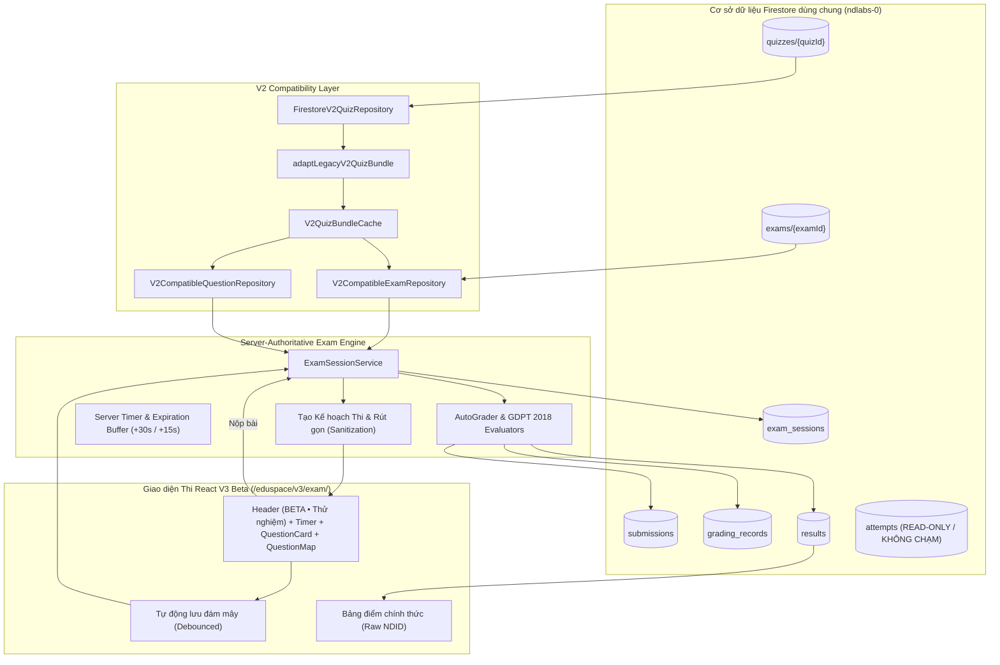

# Tài liệu Kiến trúc & Vận hành EduSpace Exam V3 Beta (Isolated Beta Runner)

## 1. Tổng quan Mục tiêu

EduSpace Exam V3 Beta là hệ thống thi và đánh giá năng lực thế hệ mới của ND Labs, được triển khai dưới dạng **BETA / THỬ NGHIỆM ĐỘC LẬP** (Isolated Beta):
- **Độc lập hoàn toàn với hệ thống V2 hiện hành:** URL chạy riêng tại `/eduspace/v3/exam/`, giao diện V2 tại `/eduspace/exam/` và template giữ nguyên 100%.
- **Dùng chung cơ sở dữ liệu Firestore:** V3 không nhân bản dữ liệu, đọc trực tiếp kho đề V2 từ collection `quizzes/{quizId}` thông qua bộ chuyển đổi chuẩn hóa (Normalizer & Compatibility Layer).
- **Cách ly dữ liệu phiên thi (Session Isolation):** Mọi phiên làm bài, câu trả lời, bản ghi chấm điểm và kết quả chính thức được ghi strictly vào các collection V3 (`exam_sessions`, `submissions`, `grading_records`, `results`). Tuyệt đối không ghi đè hay làm xáo trộn collection `attempts` của V2.

---

## 2. Luồng Xử lý Dữ liệu & Tương thích V2

---

## 3. Bản đồ Tuyến đường (Routing Map)

| Đường dẫn (Route) | Vai trò & Mục đích | Trạng thái |
| :--- | :--- | :--- |
| `/eduspace/v3/` | Trung tâm tổng quan V3 Beta (Hub): giới thiệu tính năng, danh mục đề mẫu (A111, A101), liên kết Trình Soạn thảo Visual Exam Builder | Hoàn tất |
| `/eduspace/v3/author/` | Giao diện Soạn thảo Đề thi Trực quan (Visual Exam Builder): 4 tab nghiệp vụ, cân đối điểm số thời gian thực, AI Soạn đề cho giáo viên | Hoàn tất |
| `/eduspace/v3/exam/?id={quizId}` | Trình làm bài thi V3 Beta Runner: tải đề trực tiếp từ Firestore, tính giờ server, chống lộ đáp án, hỗ trợ Ngữ liệu chung & Nhóm tự chọn | Hoàn tất |
| `/eduspace/v3/exam/demo/` | Đường dẫn rút gọn tự động chuyển hướng vào bài thi demo A111 | Hoàn tất |
| `/eduspace/v3/result/?resultId={resId}` | Bảng điểm và kết quả chính thức do server cấp | Hoàn tất |
| `/eduspace/exam/?id={quizId}` | Hệ thống V2 hiện hành (giữ nguyên vẹn 100%, không can thiệp) | Ổn định |

---

## 4. Các Loại Câu hỏi & Chấm điểm GDPT 2018

1. **Trắc nghiệm một lựa chọn (`single_choice`):**
   - 4 phương án A, B, C, D.
   - Nhận diện đúng/sai theo mã phương án.
2. **Trắc nghiệm Đúng / Sai (`true_false`):**
   - Định dạng GDPT 2018 gồm 4 ý nhỏ (a, b, c, d).
   - Thang điểm từng phần lũy tiến chuẩn Bộ GD&ĐT:
     - Đúng 1 ý: 10% điểm câu (0.1)
     - Đúng 2 ý: 25% điểm câu (0.25)
     - Đúng 3 ý: 50% điểm câu (0.50)
     - Đúng 4 ý: 100% điểm câu (1.00)
3. **Trả lời ngắn & Số học (`numeric` / `short_answer`):**
   - Hỗ trợ dung sai số học (`tolerance`) và so khớp chuỗi chuẩn hóa (bỏ dấu cách thừa, không phân biệt hoa thường).
4. **Câu hỏi nhiều ý thành phần (`multi_part`):**
   - Câu hỏi lớn gồm nhiều ý 1a, 1b... với loại câu hỏi và điểm số riêng cho từng ý con.
5. **Nhóm câu hỏi tự chọn (`ChoiceGroup`):**
   - Chọn làm k trong n câu (ví dụ 2/3 câu).
   - Server chỉ chấm điểm các câu được chọn, câu không chọn có `maxPoints = 0` và tuyệt đối không bị trừ điểm.
6. **Khối nội dung đa phương tiện (`ContentBlock`):**
   - Hỗ trợ Markdown, KaTeX, hình ảnh, bài nghe audio, bảng biểu, trích dẫn văn học.
7. **Tự luận (`essay`):**
   - Đánh dấu cần giáo viên chấm thủ công (`needsManualReview`). Không tự tiện chốt điểm nếu chưa qua người đánh giá.
8. **Quy tắc AI nghiêm ngặt:** 0% AI trong lúc học sinh thi; AI chỉ đóng vai trò trợ lý gợi ý khi giáo viên soạn đề (`POST /api/v3/author/ai-assist`).

---

## 5. Quy chuẩn Bảo mật & Nhận diện NDID

- **Bảo toàn chuỗi gốc NDID (RAW STRING):** NDID từ Firestore (`users/{CodeID}.ndid`) được giữ nguyên bản 100% (ví dụ: `owner_nd`). Tuyệt đối không tự động gắn thêm tiền tố `@` thành `@owner_nd`.
- **Server-Authoritative Identity:** Client không được tự xưng `studentCodeId`. Server giải mã token thông qua Firebase Auth / Admin Auth, đối chiếu `decoded.uid === CodeID`, sau đó đọc hồ sơ người dùng tin cậy.
- **Answer-Key Free Payload:** Khi client gọi `POST /api/v3/exam-sessions` hoặc `GET .../resume`, gói dữ liệu gửi về trình duyệt đã được khử sạch 100% trường `correct`, `correctAnswers`, `explanation` và thang điểm đáp án.

---

## 6. Kết quả Kiểm thử & Nghiệm thu

- **Unit Tests:** 116/116 tests passed across 40 test suites (bao gồm toàn bộ bài kiểm tra tương thích kho đề V2 và nền tảng đánh giá năng lực nâng cấp).
- **TypeScript Check:** `tsc --noEmit` hoàn thành với 0 lỗi.
- **Browser Automation (Puppeteer):**
  - Mở `/eduspace/v3/author/` -> kiểm tra nhận diện thanh công cụ, điểm cân đối thời gian thực, 4 tab chức năng và drawer AI Soạn đề.
  - Mở `/eduspace/v3/exam/?id=A111` -> tải thành công đề thi Tiếng Anh 11 từ Firestore V2, hiển thị prompt, chọn đáp án trắc nghiệm, kích hoạt tự động lưu (autosave), mở modal xác nhận nộp bài.
  - Mở `/eduspace/exam/` -> trang thi V2 hiện hành giữ nguyên vẹn 100%, không bị ảnh hưởng hay hồi quy.
